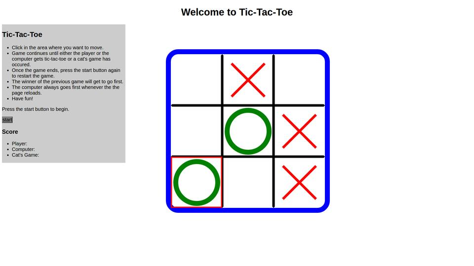

# Tic-Tac-Toe

## Introduction
paragraph The goal of this program is to solve the problem of creating an interactive version of the game Tic-Tac-Toe using HTML, CSS, and JavaScript.

## The problem broken down

###Game flow Breakdown 
+ Index.html contains a number of divs that will be used in the game environment It will also call both main.css and app.js.

+ Main.css contains all the css formatting for the game to load.
+ App.js contains all of the logic for the game, written in JavaScript.

### Game logic 
+ The JS app contains several functions.  The gameBoard Object will be initialized first, followed by auxiliary functions, and finally main functions.  This is to prevent a function from possibly being called before it is loaded.

## The JavaScript File

### Functions
####The JavaScript file utilizes the following functions:

+ **startGame(Button_element)** to start and run the game.
+ **clearBoard()** to ensure the board is cleared of any and all moves.  Will not clear board while a game is in session.
+ **isSpaceClear()** will return a boolean value indicating whether or not the particular space is empty.
+ **playerChoice(element)** will update the game board appropriately based on the player's choice.
+ **computerChoice()** will update the game board appropriately based on the computer's choice.
+ **getWinner()** checks to see if three in a row has been obtained.  Returns 'X', 'O', or null.
+ **isCatsGame()** checks to see if board is full but three in a row has not been obtained.  Returns a boolean.
+ **decideWinner()** evaluates the game board to determine if there is a winner and who one if applicable.
+ **playerWin()** alerts the player that he or she won.  Ends the game which allows the board to be reset. Icrements player score.
+ **computerWin()** alerts the player that the computer won.  Ends the game which allows the board to be reset. Icrements computer score.
+ **catsWin()** alerts the player that no one won.  Ends the game which allows the board to be reset. Icrements cat's game score.
+ **updateScores()** sends the player score, computer score, and the number of cat's games to index.html.

### Objects
####JavaScript Objects created/utilized will include:
+ Game board Object
+ Objects from the DOM

####Game Board Object Properties:
+ gameBoard[][] array
+ isPlayerX property
+ ComputerWins property
+ PlayerWins property
+ catsGames property
+ gameStart property